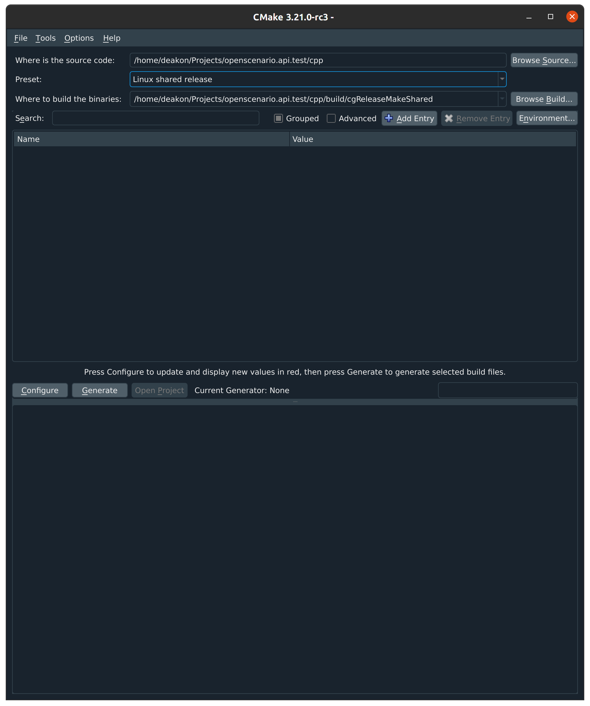

:levelToBaseDir: ..
:levelToDocDir: .
//:toc:
//:toc-placement: left
//:toclevels: 4
:showtitle:

= OpenSCENARIO API - Documentation

== Building the binaries
The OpenSCENARIO C\++ project uses `cmake` as configuration tool to support a huge variety of build environments such as Visual Studio and Unix Makefiles.
`cmake` itself is a commandline tool but it also offers a more comfortable graphical frontend named `cmake-gui`.
For systems with terminal / console access only, cmake provides a ncurses terminal frontend called `ccmake`.
In this document we focus on building the OpenSCENARIO binaries from its C++ source code using `cmake`, `cmake-gui`, and `ccmake`.
A great starting point for more information on `cmake` is the http://https://cmake.org/overview/[cmake website].

=== System requirements
In order to build OpenSCENARIO on your system the following requirements have to be fulfilled:

==== All systems
* Disk space available >= 4 GB
* Main memory >= 8 GB
* cmake >= 3.19
* a working copy of the OpenSCENARIO sources

==== Linux
* gcc >= 5.8
* uuid-dev >= 2.34 (required to build antlr4), to install uuid-dev execute this shell command:
```bash
$ sudo apt install uuid-dev
```

==== Windows
* Visual Studio 2015 or later (2022 is supported, too)

== Building on Windows with cmake-gui target Visual Studio
Start the `cmake-gui` application then a similar window like the one shown below will show up:

image:images/oscCgWin0.png[cmake_gui,width=720,float="center",align="center"]

Now follow the steps below to let cmake create a Visual Studio solution for the OpenSCENARIO source tree:

* Click on "Browse Source...", located on the top right of the cmake-gui window.
* Navigate to the location of your OpenSCENARIO source directory and select the directory `cpp` and click ok.
* Next click on the "Presets" drop-down-box labeled "<custom>" and select your build environment.
In the example shown below "VS2019 x64 shared" is chosen.
That means the solution will be build for Visual Studio 2019, creating 64 Bit binaries, and required libraries are linked dynamically during runtime.


* Now click "Configure", located in the middle left of the cmake-gui window.
An output as shown in the image below will be generated.


[NOTE]
====
All the red lines in the output section are cmake warnings generated by the antlr4 project.
====

* Next click the button "Generate", just right of "Configure".
If cmake successfully created the solution the line "Generating done" will be added at the end of the output and the button "Open Project" will be enabled.
* Finally click on the "Open Project" button to bring up your selected Visual Studio.
There you can debug, extend, and compile OpenSCENARIO sources.


== Building on Linux with cmake-gui target make
The building steps on Linux are almost the same as the ones for the Windows platform.
Start the `cmake-gui` application and a similar window like the one shown below will show up:



Now follow the steps below to let cmake create a Makefile project for the OpenSCENARIO source tree:

* Click on "Browse Source...", located on the top right of the cmake-gui window.
* Navigate to the location of your OpenSCENARIO source directory and select the directory `cpp` and click ok.
* Next click on the "Presets" drop-down-box labeled "<custom>" and select your build environment.
In the example shown above "Linux shared release" is chosen.
That means cmake will create a Makefile project using gcc / g++ as compilers, creating release binaries, and required libraries are linked dynamically during runtime.
* Now click "Configure", located in the middle left of the cmake-gui window.
An output as shown in the image below will be generated.

image:images/oscCgLin1.png[cmake_gui,width=720,float="center",align="center"]

[NOTE]
====
All the red lines in the output section are cmake warnings generated by the antlr4 project.
====

* Next click the button "Generate", just right of "Configure".
If cmake successfully created the Makefiles project the line "Generating done" will be added at the end of the output.
This time the button "Open Project" stays disable as we just created Makefiles projects and not an IDE solution.
* Finally open a terminal window and navigate to your OpenSCENARIO source directory.
For our example the default would be to go to the directory `<your osc base dir>/cpp/build/cgReleaseMakeShared`.
Type `make` to build the OpenSCENARIO binaries.

The image below shows a Linux terminal with an example output generated by make compiling the OpenSCENARIO sources.


== Building on console / terminal
You can also easily build OpenSCENARIO on systems with console access only.
But before we dive into that we will have a short excursion to cmake's `presets` as we will need them on commandline.

=== Presets in cmake
As you might have noticed we used `presets` already in cmake-gui for configuration, like the two we have seen so far: "VS2019 x64 shared" for Windows and "Linux shared release" for Linux.
These presets are defined in the file `CMakePresets.json`.
They are build up in a hierarchical structure and define a couple of configurations, e.g. defining the build type (release, debug or multi type), library binding (shared or static), and defining output folders for object files and binaries.
All these presets are accessible via console.
To know which presets are available for your current system cmake provides you with a cmake commandline option as we will see in the nest step. 
As an example head on to a Linux console and navigate to the OpenSCENARIO source tree to the folder `cpp`.
Now enter the following command to see the valid presets for the local system:
```bash
$ cmake -S . --list-presets
```
The parameter `-S .` tells cmake where to find the sources and in our case this is the current folder we are in.
After executing the command you will be prompted with the following output:

image:images/oscCMakeTermLin0.png[cmake_gui,width=720,float="center",align="center"]

In my Windows console the same command shows the following output:

image:images/oscCMakeCmdWin.png[cmake_gui,width=720,float="center",align="center"]

=== Selecting a preset
Now as we know the available presets lets continue with our example on Linux and select a preset for building our project.
On the Linux terminal enter the following command to build a debug version with static libraries:
```bash
$ cmake -S . --preset="Linux-static-debug"
```
The output created is similar to our Linux cmake-gui example despite that the output folder for the object files should be `cpp/build/cgDebugMakeStatic` and for the binaries `cpp/build/output/Linux_static/Debug`.

The configuration--in cmake-gui clicking the configure button--is performed next.

=== Configuring the project
After we selected the preset we have to configure the project (prepare it for the next step: prepare files, fetch dependencies, etc.).
This is where the ncurses ui `ccmake` shows up.
We continue with our Linux example.
For configuring the project files we start ccmake ui with this command in the cpp folder:
```bash
$ ccmake -S .
```
The following output should appear in the terminal:


In the upper part of the terminal you see the cmake variables which can freely be modified.
The bottom shows the menu with the available commands to interact with the console frontend.
As you can see there is a menu entry `[c] Configure` which we will use in a view moments.
Important: there is no entry for "generate" yet.
The generate entry will appear only after successful configuration directly behind the `[c] Configure` entry.

You may already have noticed that the ccmake's frontend capabilities are quite similar to its graphical pendant cmake-gui.
Here you can also modify cmake parameters, configure, and generate the project files.
The only thing different: you cannot select a different preset.

[NOTE]
====
Compared to `cmake-gui` `ccmake` is missing the capability of selecting `presets`.
====

To configure now the project just hit the `c` key.
The output shown will be quite the same as we have seen before when selecting the preset.
To exit the output screen just press the `e` key.

In the next step we will generate the project files so we can finally compile our OpenSCENARIO sources.

=== Generating the project files
Currently we are in the state of a configured project but we are still missing the necessary Makefiles in order to compile our project.

If the configuration step was successful a new menu entry at the bottom of the terminal windows--right after `[c] Configure`-should appear: `[g] Generate`.

image:images/oscCCMakeTermLin1b.png[cmake_gui,width=720,float="center",align="center"]

Now just press the `g` key to start the generation process.
If generate was successful then ccmake will quit to console.
According to our example you may go now to the folder `cpp/build/cgDebugMakeStatic` and build the binaries.

=== Commandline steps condensed
The necessary steps to setup the OpenSCENARIO build environment for console / terminal are shown in short form as follows:
```bash
$ cd <your OpenSCENARIO cpp folder>
$ cmake -S . --list-presets                 # List available presets for local system
$ cmake -S . --preset="<your-preset>"       # Select a preset
$ ccmake -S .                               # Bring up ncurses frontend, configure and generate project files
$ cd <your project files folder>            # Go to the generated project files
$ make                                      # Compile the sources
```