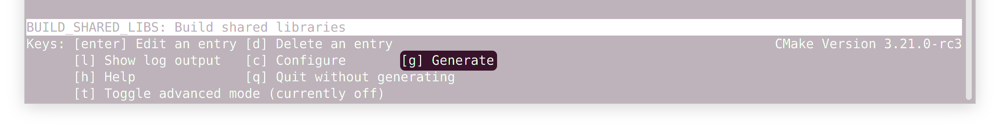

:levelToBaseDir: ../..
:levelToDocDir: ..
:toc:
:toc-placement: left
:toclevels: 4
:showtitle:

= OpenSCENARIO API - Documentation

== Getting started on C++
A great source of how to start using the API are the test sources
link:{levelToBaseDir}/cpp/applications/openScenarioTester/v1_0/src[test sources].

Generally there are two major use cases for using the library. 

* *As a standalone checker*. A command line application that is called to
validate an OpenSCENARIO file. 
* *As an embedded library*. Embedding the programming interface and add read capability to our own application.

=== Standalone checker

To use the library as a standalone program we would typically use the
compiled C++ binary

`/cpp/build/output/Linux_shared/Release/OpenScenarioReader`. 

See the section <<BuildingTheBinaries,Building the binaries>> for building instructions.

For example the binary is located in the following directory, dependent
on your development platform: 

* Linux: `./cpp/build/output/Linux_shared/Release/OpenScenarioReader`
* Windows `./cpp/build/output/x64_shared/Release/OpenScenarioReader`

Navigate your command shell to the appropriate folder above and first
execute the following command on Linux once to tell the runtime system
where to find the dependent libraries:

[source,bash]
----
$ export LD_LIBRARY_PATH=$LD_LIBRARY_PATH:.
----

Then start the OpenScenarioReader with:

[source,bash]
----
$ ./OpenScenarioReader
----

This will generate the following output:

```
****************************************
* ASAM OpenSCENARIO 1.0 Checker (2020) *
****************************************
OpenScenarioChecker [[{-i <filename>|-d <dirname>} [-p <paramfilename>]] | -v]
Options:
-i  <filename> file to be validated
-d  <directory> directory to be validated
-p  <paramfilename> a file with name/value pairs. One line per name/value pair. tab separated
-v  print program version
```


==== Checking a file

See link:{levelToDocDir}/examples/simpleExample[simpleExample] To test a particular file, e.g. `DoubleLaneChanger.xosc` execute the following command:

[source,bash]
----
$ ./OpenScenarioReader -i examples/simpleExample/SimpleExample.xosc
----

Result:

```
****************************************
* ASAM OpenSCENARIO 1.0 Checker (2020) *
****************************************
Checking 'examples/simpleExample/SimpleExample.xosc'
Validation succeeded with 0 errors and 0 warnings.
```

A failing validation See link:{levelToDocDir}/examples/defectExample[defectExample]

[source,bash]
----
$ ./OpenScenarioReader -i examples/defectExample/DefectExample.xosc
----

Result:

```
****************************************
* ASAM OpenSCENARIO 1.0 Checker (2020) *
****************************************
Checking 'examples/defectExample/DefectExample.xosc'
ERROR: Cannot resolve parameter 'DefectParameter' (41,53)
Validation failed with 1 errors and 0 warnings.
```


==== Injecting parameters

It is possible to inject parameters into the ASAM OpenSCENARIO checker.
Use `-p` to specify a filename for the parameters. See
link:{levelToDocDir}/examples/injectedParamsExample[injectedParamsExample]

[source,bash]
----
$ ./OpenScenarioReader -i examples/injectedParamsExample/InjectedParamsExample.xosc -p examples/injectedParamsExample/params.conf
----

In the parameter file (here `params.conf`) we define name/value pairs.
One line per definition. '#' is used for comments. We use tab as a delimiter between name and value:

```
****************************************
* ASAM OpenSCENARIO 1.0 Checker (2020) *
****************************************
Used Parameters:
    EgoStartS   60
    HostVehicle car_red
    TargetVehicle   car_white
Checking 'examples/injectedParamsExample/InjectedParamsExample.xosc'
Validation succeeded with 0 errors and 0 warnings.
```

[[showing-the-program-version]]
==== Showing the program version

[source,bash]
----
$ ./OpenScenarioReader -v
----

Result:

```
****************************************
* ASAM OpenSCENARIO 1.0 Checker (2020) *
****************************************
Program version 1.1.0
```

Telling us that this version supports OpenSCENARIO standard 1.0 and the version of the implementation is 1.1.0 . 

=== Embedding the Library 
To use the OpenSCENARIO as an embedded library we use the compiled library `libOpenScenarioLib` on Linux and on Windows. Both libraries on Linux as well as on Windows have third party dependencies. 
See the link:{levelToBaseDir}/README.md[README.MD] file in the project root for building instructions. We have the choice to either use the __static version__ or the __shared version__.

* *static version* includes all third party libraries in one monolithic library file
`libOpenScenario.a` on Linux and `libOpenScenario.lib` on
Windows or we build the 
* *shared version* results in shared versions of the third party libraries which have to be linked to
the project, too. Currently these are the two files
`libOpenScenario.so.1.1.0` and `libantlr4-runtime.so.4.8` on Linux
and `libOpenScenario.dll` and `libantlr4-runtime.dll` on Windows.

For both, static and shared version `CMakeLists.txt` template files are already generated. The zip-file `openScenario.zip` contains templates for static and shared builds for both Linux and Windows.

==== Example: checking a single file

When checking a single file with no catalog implications, use the
`XmlScenarioLoaderFactory` to create a loader.

[source,c++]
----
// Creating a message logger to pick up the messages
auto msgLogger = std::dynamic_pointer_cast<NET_ASAM_OPENSCENARIO::IParserMessageLogger>(_messageLogger);
const auto kMessageLogger = std::make_shared<NET_ASAM_OPENSCENARIO::MessageLoggerDecorator>(msgLogger);

// Instantiating the factory
std::string fileName = _executablePath + "/" + kInputDir + "DoubleLaneChanger.xosc";
auto loaderFactory = NET_ASAM_OPENSCENARIO::V_1_0::XmlScenarioLoaderFactory(fileName);

// Creating the loader
auto loader = loaderFactory.CreateLoader(std::make_shared<NET_ASAM_OPENSCENARIO::FileResourceLocator>());

// Loading 
auto openScenario = std::static_pointer_cast<NET_ASAM_OPENSCENARIO::V_1_0::IOpenScenario>
    (loader->Load(kMessageLogger)->GetAdapter(typeid(NET_ASAM_OPENSCENARIO::V_1_0::IOpenScenario).name()));

//Check for errors
if (!kMessageLogger->HasErrors())
{
    // Browse through the results
    auto fileHeader = openScenario->GetFileHeader();
    std::cout << "Major Revision :" << fileHeader->GetRevMajor() << std::endl;
    std::cout << "Minor Revision :" << fileHeader->GetRevMinor() << std::endl;
}
----

==== Example: checking a file and resolve the imports from catalogs

When checking a file and resolve its imports from catalog, use the `XmlScenarioImportLoaderFactory` to create a loader. 
Then the catalog references are resolved and the errors and warnings from the catalog files are picked up in a separate logger.

[source,c++]
----
// Creating a message Logger to pick up the messages
auto messageLogger = std::make_shared<NET_ASAM_OPENSCENARIO::SimpleMessageLogger>(NET_ASAM_OPENSCENARIO::ErrorLevel::INFO);

// create another messageLogger for logging the messages that occur from imported files
auto catalogMessageLogger = std::make_shared<NET_ASAM_OPENSCENARIO::SimpleMessageLogger>(NET_ASAM_OPENSCENARIO::ErrorLevel::INFO);

// Instantiating the factory
NET_ASAM_OPENSCENARIO::V_1_0::XmlScenarioImportLoaderFactory
    loaderFactory(catalogMessageLogger, _executablePath + "/" + kInputDir +
    "simpleImport/simpleImport.xosc");

// Creating the loader with a file resource locator (we are reading directly from a file system)
auto loader = loaderFactory.CreateLoader(std::make_shared<NET_ASAM_OPENSCENARIO::FileResourceLocator>());

// Loading the scenario
auto openScenario = std::static_pointer_cast<NET_ASAM_OPENSCENARIO::V_1_0::OpenScenarioImpl>(loader->Load(messageLogger)
    ->GetAdapter(typeid(NET_ASAM_OPENSCENARIO::V_1_0::OpenScenarioImpl).name()));

// Get the list of scenario objects
auto scenarioObjects = openScenario->GetOpenScenarioCategory()->GetScenarioDefinition()
    ->GetEntities()->GetScenarioObjects();

for (auto&& scenarioObject : scenarioObjects) 
{
    // Access the object that is imported from a catalog with the name "Ego"
    if (scenarioObject->GetName() == "Ego") 
    {
        // Get the catalog reference
        auto catalogReference = scenarioObject->GetEntityObject()->GetCatalogReference();

        if (catalogReference && catalogReference->GetEntryName() == "car_white")
        {
            auto catalogRef = catalogReference->GetRef();
            // Now check the type.
            if ( NET_ASAM_OPENSCENARIO::V_1_0::CatalogHelper::IsVehicle(catalogRef))
            {
                auto vehicle = NET_ASAM_OPENSCENARIO::V_1_0::CatalogHelper::AsVehicle(catalogRef);
                // Now you can access the resolved vehicle
                auto axles = vehicle->GetAxles();
                // get the additonal axles
                auto additionalAxles = axles->GetAdditionalAxles();
                if (additionalAxles.empty()) 
                {
                    std::cout << "Ego has 2 axles (front, rear)";
                }
                else 
                {
                    std::cout << "Ego has " << 2 + additionalAxles.size()
                        << " axles (front, rear and "
                        << additionalAxles.size()
                        << " addtional axles";
                }
            }
        }
    }
}
----

==== Example: checking a file and inject parameter values from outside

OpenSCENARIO provide a mechanism to declare global parameters , right after the `FileHeader` element:

[source,xml]
----
<OpenSCENARIO>  
  <FileHeader revMajor="1" revMinor="0" date="2020-07-24T10:00:00" description="Sample Scenario - parameter" author="ASAM"/>
  <ParameterDeclarations>
      <ParameterDeclaration name="testBoolean" value="false" parameterType="boolean"/>
      <ParameterDeclaration name="testInteger" value="1" parameterType="integer"/>
      <ParameterDeclaration name="testUnsignedInt" value="1" parameterType="unsignedInt"/>
      <ParameterDeclaration name="testString" value="testString" parameterType="string"/>
      <ParameterDeclaration name="testDateTime" value="2017-02-24T10:00:00" parameterType="dateTime"/>
      <ParameterDeclaration name="testUnsignedShort" value="5" parameterType="unsignedShort"/>
      <ParameterDeclaration name="testDouble" value="1.1" parameterType="double"/>
  </ParameterDeclarations>
</OpenSCENARIO>
----

When loading a scenario, the API allows to override the default values from outside. We use a name value map and hand it over as an argument to the `load` method.

[source,c++]
----
std::map<std::string, std::string> injectedParamters;
injectedParamters.emplace("testBoolean", "true");
injectedParamters.emplace("testInteger", "2");
injectedParamters.emplace("testUnsignedInt", "2");
injectedParamters.emplace("testString", "injected");
injectedParamters.emplace("testDateTime", "2018-02-24T10:00:00");
injectedParamters.emplace("testUnsignedShort", "2");
injectedParamters.emplace("testDouble", "2.0");

// Creating the loader with a file resource locator and the injected parameters
auto loaderFactory = NET_ASAM_OPENSCENARIO::V_1_0::XmlScenarioLoaderFactory(filename);
auto loader = loaderFactory.CreateLoader(std::make_shared<NET_ASAM_OPENSCENARIO::FileResourceLocator>());
auto ptr = loader->Load(_messageLogger, injectedProperties);
----

The injected parameter values override the default values in the scenario file.

Please be aware of the following restrictions 

* The injected parameters must be declared globally. Otherwise a warning is issued. 
* The values must be convertible to the target datatype of the declared parameter. The format must follow the format for XSD datatypes (as in the XML). 
* If conversion fails, an error is issued. 
* Only scenario definitions declare global parameters. It is not useful to declare them for catalogs.

Please see link:{levelToBaseDir}/cpp/applications/openScenarioTester/v1_0/src/TestInjectedParameters.h[TestInjectedParameters.h] for detailed tests on error handling.

== General architectural aspects
This article is about some fundamental aspects in the API's artchitecture. It may help to understand the intention behind the design decisions and also gives you a entry point in coding and integration
issues.

=== Generative approach
The backbone of the OpenSCENARIO API is represented by classes, enumerations and interfaces generated from a released OpenSCENARIO model. Therefore, the API is tightly coupled to the model.

This paradigm makes the API highly consistent to the UML model. If we have a class in the UML model called `LaneChangeTarget` we will find a corresponding interface `ILaneChangeTarget` in the namespace `NET_ASAM_OPENSCENARIO::v1_0`. If this class has a property called `relativeTargetLane`, we can be sure that there is a corresponding getter in the interface which is called `GetRelativeTargetLane`. Consistently, if this model property `relativeTargetLane` is of the model type `RelativeTargetLane` the getter will return a result of `IRelativeTargetLane`.

As an example: `ILaneChangeTarget`

[source,cpp]
----
/**
 * This is a automatic generated file according to the OpenSCENARIO specification version 1.0
 * <p>
 * From OpenSCENARIO class model specification:
 * Defines the target lane of the LaneChangeAction.
 * 
 * @author RA Consulting OpenSCENARIO generation facility
*/
class ILaneChangeTarget : public virtual IOpenScenarioModelElement
{
 public:
    virtual ~ILaneChangeTarget() = default;

    /**
     * From OpenSCENARIO class model specification:
     * Lane change direction relative to entity's lane.
     * 
     * @return value of model property relativeTargetLane
    */
    virtual std::shared_ptr<IRelativeTargetLane> GetRelativeTargetLane() const
    {
        return nullptr;
    }

    /**
     * From OpenSCENARIO class model specification:
     * Lane change target lane number.
     * 
     * @return value of model property absoluteTargetLane
    */
    virtual std::shared_ptr<IAbsoluteTargetLane> GetAbsoluteTargetLane() const
    {
        return nullptr;
    }


};
----

This pattern is is applied to all classes, interfaces and enumerations of the model. Not even that, also the descriptions in the classes, interfaces, enumerations and properties are consistent with the model annotations from UML. The documentation in the javadoc is fully in synch with the annotations in the UML model. So, the generative approach offers great consistency with a single point of truth in the UML model rather than an imaginary 'copy and paste' consistency.

This leads to great efficiency and a clean architecture where more than 95% of the source code is automatically generated. This elevates productivity with about 80,000 lines of code created for the cpp project and allows transfer to other platforms like C++. Transfer comes with a fair amount of initial work as well as for keeping the platforms in synch over time.


=== Don't-edit-generated-files policy
All generated files are located in the `generated` folder. These files must not be edited manually. Moreover it is recommended to see RA Consulting GmbH or ASAM e.V. for changes in the generated code.

=== Generative approach and product dimensions

Product dimensions can lead to a high amount of work for creating and maintaining product lines. For example a dimension could be the _programming platform_. In order to provide a product for different programming platforms, there might be a need for a single source of code and additional adapters to other platforms. Java and C\++ might be coupled through JNI etc. Practically, this is often very painful. Java is not the #1 platform on desktop UI systems whereas C++ is often not allowed to run on backend servers. Using integrated java code in a C\++ environment or using C++ in a java environment often feels unhandy and end up in the worst from both world: Our code is dependent on a java VM as well as on the binary platform. One solution is to maintain a common architecture with a single model and generators that take minimal amount to deploy the architecture to the different platforms. This is exactly where a generative approach has its strengh and an efficient workflow is able to produce and to maintain source code. Other product dimensions are _versions_ (1.0, 1.1, 2.0 etc.), operating systems (Linux, Mac, Windows), deployment platforms (Server, desktop, embedded) etc. In these multidimensional space (e.g. providing a native lib for mac and version 1.0) a generative approach is one way to manage dependencies and minimize the amount of work.

Remarks: The API currently supports C\++ only. The java product line has been given up in favor of developing a C++ product. The java product line is frozen in the 1.0 version of the library.

=== Versioning as a product dimension

When supporting a standard, versioning is a product dimension that should be supported. Since we cannot look in the future and foresee the changes, we still can be sure that changes happen. So, the worst case is not to be faced with incompatible changes of a new version, but a dead-end standard that does suffer from a bad change management. Therefore, even when our world is "version 1.0 only" right at that moment, we better have strategies for versioning, migration etc.. Change management is considered an important architectural aspect.

=== Providing compile time support

As described above, if code is generated consistently with the UML model, we have everything ready when using the API at compile time. We can use the classes, the interfaces and the methods that are provided right off-the-shelf. We may make use of the documentation, code completion and the compiler detects misspellings and inconsistencies right before we are able to run a error prone program. So, when we follow the paradigm that costs for error detection and fixes rise extremely along the development cycle of a software, it is best to detect our errors as soon as we write it (low fixing costs) rather than after having the software delivered to the customer (high fixing costs). In this sense, generating concrete artifacts, like classes, enumerations, interfaces and methods is not only consistent with the UMl model (single source of domain knowledge) but also a great way for managing quality and costs. So, let the compiler be you friend.

=== Version management and namespaces

As said `versioning` is a dimension in our software product line and we better have strategies to support different versions of the standard with our software. Since we cannot rely on downward compatibility, there are different aspects when providing compatibility to multiple versions. E.g. to declare artifacts as _deprecated_ or we transparently map new versions to older versions. The OpenSCENARIO API relies heavily on namespaces for different versions. They provide maximum separation among the different version of the standard. In many cases data structures change. For example an `EntityAction` in version 1.0 might have some other semantic as `EntityAction` in version 2.0 (as said: we cannot foresee it). The OpenSCENARIO API's policy is that the complete set of artefacts (interfaces, classes, enumerations) are created for every single version. This means, that there is a `NET_ASAM_OPENSCENARIO::v1_0::IEntityAction` and another interface `NET_ASAM_OPENSCENARIO::v2_0::IEntityAction`. So, every version specific set of classes, enumeration and interfaces provided by the API is self-containted and completely independent from other versions. This has benefits and drawbacks. A benefit, as said, is that the different versions are greatly decoupled. Old versions are very stable and do not change over time. E.g. once released, `NET_ASAM_OPENSCENARIO::v1_0::IEntityAction` will not change. This means the domain knowledge, models and the API itself are snapshots of a released standard. As the domain knowledge evolves, this explicitly results in a new version of the standard, a new version of the model, and a new version of the API.


=== Drawback of separating versions

The drawback is that with every new version, we have to deal with a complete new set of artefacts. Once we have used `NET_ASAM_OPENSCENARIO::v1_0::IEntityAction` in our program and the semantics have not changed for version 2.0, we don't wanna integrate `NET_ASAM_OPENSCENARIO::v2_0::IEntityAction` in the same way. And it's even worse when we have a new set of 200+ interfaces. As we expect that there *are only a few semantic changes*, let's say in 10% of the classes, integrating a complete set of new classes might be an effort that does not justify the amount of work.


=== Compile time support and generic interface

As said, the API propagates a clean separation of versions which results in different set of artefacts (classes, enumerations, interfaces) for each version. On the other hand, the API respects the need on being flexible at runtime and clearly identifies the extra amount of work that might result from integrating a whole new set of version dependent artefacts. Therefore, every class additionally supports the interface `IOpenScenarioFlexElement`. This interface itself is independent from a version and might be used when dealing with different version dependent sets is unhandy or inappropriate. The functions of these interface are usually used with version dependent keys which might be still supported in the future. If this is the case, they imply a minimum amount of work for integrating a new version. Especially, when only a few changes are made from version to version. This, of course, comes on the expense of compile time support and can easily lead to runtime errors. So, using this interface, we should pay extra attention to changes because the compiler can't.

The example shows the usage of the interface: This first line uses the compile time and type-safe interface `IFileHeader`

[source,cpp]
----
NET_ASAM_OPENSCENARIO::v1_0::IFileHeader fileHeader = openScenario.GetFileHeader();
----

The next line uses the flexible interface.

[source,cpp]
----
IOpenScenarioFlexElement flexElement=
    ((IOpenScenarioFlexElement) openScenario).GetChildElement(OscConstants.ELEMENT__FILE_HEADER);
----

So, these two methods deliver the exact same object instance when applied to the same parent object. The main and important difference is that the second example could also return a `NET_ASAM_OPENSCENARIO::v1_2::IFileHeader` in the future, if `OscConstants.ELEMENT__FILE_HEADER` is still supported for version 1.2.

The next lines of code are still valid when the uml class `FileHeader` does not change from version 1.0 to version 1.2.

[source,cpp]
----
IOpenScenarioFlexElement flexElement=
    openScenario.GetOpenScenarioFlexElement().GetChildElement(OscConstants.ELEMENT__FILE_HEADER);
DateTime date  = flexElement.GetDateTimeProperty(OscConstants.ATTRIBUTE__DATE);

unsigned short minorRef = flexElement.GetUnsignedShortProperty(OscConstants.ATTRIBUTE__REV_MINOR);
unsigned short majorRef = flexElement.GetUnsignedShortProperty(OscConstants.ATTRIBUTE__REV_MAJOR);    
std::string description = flexElement.GetStringProperty(OscConstants.ATTRIBUTE__DESCRIPTION);    
----

=== Alternatives for version management
Consider to use the https://en.wikipedia.org/wiki/Adapter_pattern[Adapter-pattern] before you integrate the API in your source code. As an alternative, contibute a set of adapters to the project in the future and make the adopters available for all OpenSCENARIO programmers.

== Tutorial on checker rules
This tutorial assists when implementing our own checker rules and apply
them to a loaded tree. It applies to the C++ platform and shows the
overall principles.

=== Checker rules 
Checker rules are constraints on model object instances that are either defined implicitly in the standard or can be adopted to our own needs. Whenever we want to ensure authoring rules and guidelines that apply for our company or our partners, the checker rules API is a good choice to implement our own validation. With a minimal effort, we will implement our own checker rules, add it to a checker and start the validation of our loaded tree. A message logger will pick up any violation to our given rules with the exact location pointing to the original file. This tutorial will show how to write our own checker rules.

=== Checker rules API

The backbone of the checker rules API is the interface `ICheckerRule`. By implementing this interface we write our own checker rules:

[source,cpp]
----
class CheckerRule
{
    public:
        virtual  ~CheckerRule() = default;
};

/**
 * This represents a rule that can be applied to any model object instance.
 * It implements the command pattern. The rule is added to the type and applyRule
 * is executed when the object has been filled.
 *
 */
template <class T>
class ICheckerRule: public CheckerRule
{
    public:
        ICheckerRule() = default;
        virtual  ~ICheckerRule() = default;
        virtual void ApplyRule(std::shared_ptr<IParserMessageLogger>& messageLogger, std::shared_ptr<T> object) {}
};
----

==== First example

Our first example will show, how to ensure that the major revision is always 1 and the minor revision is always 0. If this rule is violated, a warning is issued.

===== Implementing the ICheckerRule interface

The first step is to define a class `VersionCheckerRule` that implements the `ICheckerRule` with the generic type `IFileHeader`. `IFileHeader` is the model type where to access the `majorRev` and the `minorRev`property.

As we want to use this class for any combination of expected major revisions and minor revisions, we hand over the expectes major revison and the expected minor revision to the constructor and store them in the instance.

[source,cpp]
----
class VersionCheckerRule: public ICheckerRule<IFileHeader> 
{
    private:
        int _majorRev;
        int _minorRev;

    public:
        /**
         * @param majorRev The expected major revision
         * @param minorRev The expected minor revision
         */
        VersionCheckerRule(const int majorRev, const int minorRev): _majorRev(majorRev), _minorRev(minorRev) {}

        ...
};
----

The class must implement the `applyRule` method. Please note that the generic parameter type of object is now realized with the type `IFileHeader`.

[source,cpp]
----
void ApplyRule(
    std::shared_ptr<IParserMessageLogger>& messageLogger,
    std::shared_ptr<IFileHeader> object) override
{
    ...
}

----

At this point, we are ready to implement our checks. First, let's get the major revision and the minor revision from the `object` and store them in local variables:

[source,cpp]
----
void ApplyRule(std::shared_ptr<IParserMessageLogger>& messageLogger, std::shared_ptr<IFileHeader> object) override
{
    if (!object) return;

    const auto kRevMajor = object->GetRevMajor();
    const auto kRevMinor = object->GetRevMinor();

    ...
}
----

Now compare them with the expected values:

[source,cpp]
----
void ApplyRule(
    std::shared_ptr<IParserMessageLogger>& messageLogger,
    std::shared_ptr<IFileHeader> object) override
{
    if (!object) return;

    const auto kRevMajor = object->GetRevMajor();
    const auto kRevMinor = object->GetRevMinor();

    if (kRevMajor != _majorRev || kRevMinor != _minorRev) 
    {
        .....

    }
}
----

When we issue a warning, we have the great possibility to add locations. The user can then trace the warning back to a line and to a column of the original file. So let's get the location from the `object`. We do this by requesting an `ILocator` adapter from the `object`. If an `ILocator` adapter is supported, we would get an instance of `ILocator`.

[source,cpp]
----
void ApplyRule(
    std::shared_ptr<IParserMessageLogger>& messageLogger,
    std::shared_ptr<IFileHeader> object) override
{
    if (!object) return;

    const auto kRevMajor = object->GetRevMajor();
    const auto kRevMinor = object->GetRevMinor();

    if (kRevMajor != _majorRev || kRevMinor != _minorRev) 
    {
        auto locator = 
            std::static_pointer_cast<ILocator>(object->GetAdapter(typeid(ILocator).name()));

        ...

    }
}
----

1Please note, there might be objects that do not support the `ILocator` adapter. E.g. when the scenario is loaded from a binary file instead of an XML file. In this case, no text line information and no column information would be available. If we are loading our files from XML, we do not have to pay attention to this fact.

The only thing that we are still missing is the warning to be issued. We are adding an instance of a `FileContentMessage` with a message, an error level and a textmarker.

[source,cpp]
----
void ApplyRule(
    std::shared_ptr<IParserMessageLogger>& messageLogger, 
    std::shared_ptr<IFileHeader> object) override
{
    if (!object) return;

    const auto kRevMajor = object->GetRevMajor();
    const auto kRevMinor = object->GetRevMinor();

    if (kRevMajor != _majorRev || kRevMinor != _minorRev) 
    {
        auto locator = 
            std::static_pointer_cast<ILocator>(object->GetAdapter(typeid(ILocator).name()));

        if (locator) 
        {
            auto msg = FileContentMessage(
                "Major revision and minor revision are expected to be " 
                    + std::to_string(_majorRev) 
                    + " and " 
                    + std::to_string(_minorRev), 
                WARNING, 
                locator->GetStartMarker());
            messageLogger->LogMessage(msg);
        }

    }
}
----

That's it. Our checker is now ready to be used.

===== How to apply rules during runtime

With our checker ready to be used, we can apply the checker rule to a loaded `IOpenScenario` tree. Please see <<Getting started on C++>> on how a tree is loaded from a file.

[source,cpp]
----
// the root of the tree is available in the IOpenScenario openScenario variable
// Instantiate a checker now

NET_ASAM_OPENSCENARIO::v1_0::ScenarioCheckerImpl scenarioChecker;

// The sceanrio checker provided a method for every model type (here IFileHeader) to add
// CheckerRule

scenarioChecker.AddFileHeaderCheckerRule(std::make_shared<NET_ASAM_OPENSCENARIO::v1_0::VersionCheckerRule>(1, 0));

// Create a message logger to pick up the messages

auto simpleMessageLogger =
    std::make_shared<NET_ASAM_OPENSCENARIO::SimpleMessageLogger>(
        NET_ASAM_OPENSCENARIO::ErrorLevel::INFO);

// Now call the checkScenario method to check the tree
scenarioChecker.CheckScenario(simpleMessageLogger, openScenario);

// Now check the picked up messages
for (auto&& message : simpleMessageLogger->GetMessages()) 
{
    (void)message;
    
    // do somethong with the messaged that are picked up during the check
}

----

We do not need to traverse through the tree and search for instances. The scenario checker sequentially applies the rule to any instance of the designated type we realized in our checker rule (here `IFileHeader`). In our example it is obvious that only one instance of `IFileHeader` exists in the tree. For other types like `IAct`, `IEvent` etc. many instances may available in the tree and every instance is checked.

==== Example: ensure "Ego" is defined in the scenario.

This example shows how to ensure that a scenario object with the name "Ego" is defined. Otherwise an error is issued. There is definitly a little bit more work to do here, but it should be straight forward after completing the example above. Obviously `IEntities` (with its instances of `IScenarioObject`) is the right type to check.

[source,cpp]
----
class EgoCheckerRule: public
    NET_ASAM_OPENSCENARIO::ICheckerRule<NET_ASAM_OPENSCENARIO::v1_0::IEntities> 
{
    ...
};
----

The `ApplyRule` looks like this:

[source,cpp]
----
void ApplyRule(
    std::shared_ptr<NET_ASAM_OPENSCENARIO::IParserMessageLogger>& messageLogger, std::shared_ptr<NET_ASAM_OPENSCENARIO::v1_0::IEntities> object
    ) override
{
    bool isEgoDefined = false;

    // We are adding the validation code here
    
    auto scenarioObjects = object->GetScenarioObjects();
    
    if (!scenarioObjects.empty()) 
    {
        for ( auto&& scenarioObject : scenarioObjects) 
        {
            auto name = scenarioObject->GetName();
            for (std::string::iterator it = name.begin(); it != name.end(); ++it)
                *it = std::tolower(*it, std::locale());
            if (name == "ego")
            {
                isEgoDefined = true;
                break;
            }
        }
    }

    if (!isEgoDefined) 
    {
        auto locator = std::static_pointer_cast<NET_ASAM_OPENSCENARIO::ILocator>(object->GetAdapter(typeid(NET_ASAM_OPENSCENARIO::ILocator).name()));
        if (locator) 
        {
            auto msg = NET_ASAM_OPENSCENARIO::FileContentMessage("No ego vehicle defined", NET_ASAM_OPENSCENARIO::ErrorLevel::ERROR, locator->GetStartMarker());
            messageLogger->LogMessage(msg);
        }
        
    }
}
----

The rule is added by

[source,cpp]
----
scenarioChecker.AddEntitiesCheckerRule(std::make_shared<EgoCheckerRule>());
----


=== Further checker rules

As we've seen in the examples, many useful checkings may apply to an OpenSCENARIO model instance. Unfortunately, OpenSCENARIO defines relatively few constraints in the model or in the user guide (repectively there is no explicit checker rule concept but a lot of implicit constraints in the user guide). Nevertheless, some checkings are essential and the checker rule API is the tool to ensure these rules.

Some examples: - Ensure a naming convention for the object names (e.g. ensure camel-case notation) - Ensure unique naming in a list of objects (e.g. unique names for scenario objects, so "ego" cannot be defined twice. Unique names of evens in a maneuver, etc.) - Other constraints that are not exlicitly defined in the standard but reduce ambiguity. 

=== Range checker rules - Built-in validation for ranges 
Defining a primitive datatype like `unsigned int` or `double` does already represent an important constraint when a property of a class is defined. Many properties have further range constraints that are documented in the annotations of the properties e.g. the property `delay` in the model class `Condition` must be zero or greater than zero. The annotation says about the property `delay` that is of type `double`: 'Time elapsed after the edge condition is verified, until the condition returns true to the scenario. Unit: s; Range: [0..inf[.' The OpenSCENARIO API defines all the range properties as built-in checker rules that can be applied by any user of the library.

Please see these corresponding classes if you are interested in the details:

* NET_ASAM_OPENSCENARIO::v1_0::RangeCheckerHelper;
* TestRangeChecker


== Konwn issues
A provided list with the known issues and possible enhancements. 

* *I18n* Currently, the messages that are issued are hardcoded on the
basis of the english language. A i18n concept could outsource the
messages to provide support for different languages. 
* *Resolving object references* Though the framework is ready for that, the objects
referenced from other objects are not resolved yet. This has two
reasons. The first one is simply the time to invest. For any of the
types a seperate resolution strategy must be implemented. Second, the
general resolving strategy is still a little bit unclear. See '3.1.2
Naming' in the 'OpenSCENARIO User-Guide 1.0'. With unresolved
references, the method `GetTargetObject` of the interface
`INamedReference` will always return `null`. Of cource, you can still
use the name that represents the reference when calling `GetNameRef`. 
* *Supporting more programming platforms* As writing this, the C++ has
just been added. We think it is good idea to add further platforms like
Python. 
* *Reading from zipped files* Though the standard does not
explicitely mention this, we think it is a great idea to pack the
scenario file and its dependendent catalogs in a self-contained
zip-archive. The API allows great support for that by providing the
`IResourceLocator` interface.


[[BuildingTheBinaries]]
== Building the binaries
The OpenSCENARIO C\++ project uses `cmake` as configuration tool to support a huge variety of build environments such as Visual Studio and Unix Makefiles.
`cmake` itself is a commandline tool but it also offers a more comfortable graphical frontend named `cmake-gui`.
For systems with terminal / console access only, cmake provides a ncurses terminal frontend called `ccmake`.
In this document we focus on building the OpenSCENARIO binaries from its C++ source code using `cmake`, `cmake-gui`, and `ccmake`.
A great starting point for more information on `cmake` is the http://https://cmake.org/overview/[cmake website].

=== System requirements
In order to build OpenSCENARIO on your system the following requirements have to be fulfilled:

==== All systems
* Disk space available >= 4 GB
* Main memory >= 8 GB
* cmake >= 3.19
* a working copy of the OpenSCENARIO sources

==== Linux
* gcc >= 5.8
* uuid-dev >= 2.34 (required to build antlr4), to install uuid-dev execute this shell command:

[source,bash]
----
$ sudo apt install uuid-dev
----

==== Windows
* Visual Studio 2015 or later (2022 is supported, too)

=== Building on Windows with cmake-gui target Visual Studio
Start the `cmake-gui` application then a similar window like the one shown below will show up:


Now follow the steps below to let cmake create a Visual Studio solution for the OpenSCENARIO source tree:

* Click on "Browse Source...", located on the top right of the cmake-gui window.
* Navigate to the location of your OpenSCENARIO source directory and select the directory `cpp` and click ok.
* Next click on the "Presets" drop-down-box labeled "<custom>" and select your build environment.
In the example shown below "VS2019 x64 shared" is chosen.
That means the solution will be build for Visual Studio 2019, creating 64 Bit binaries, and required libraries are linked dynamically during runtime.


* Now click "Configure", located in the middle left of the cmake-gui window.
An output as shown in the image below will be generated.


[NOTE]
All the red lines in the output section are cmake warnings generated by the antlr4 project.


* Next click the button "Generate", just right of "Configure".
If cmake successfully created the solution the line "Generating done" will be added at the end of the output and the button "Open Project" will be enabled.
* Finally click on the "Open Project" button to bring up your selected Visual Studio.
There you can debug, extend, and compile the OpenSCENARIO sources.


=== Building on Linux with cmake-gui target make
The building steps on Linux are almost the same as the ones for Windows.
Start the `cmake-gui` application and a similar window like the one shown below will show up:


Now follow the steps below to let cmake create a Makefile project for the OpenSCENARIO source tree:

* Click on "Browse Source...", located on the top right of the cmake-gui window.
* Navigate to the location of your OpenSCENARIO source directory and select the directory `cpp` and click ok.
* Next click on the "Presets" drop-down-box labeled "<custom>" and select your build environment.
In the example shown above "Linux shared release" is chosen.
That means cmake will create a Makefile project using gcc / g++ as compilers, creating release binaries, and required libraries are linked dynamically during runtime.
* Now click "Configure", located in the middle left of the cmake-gui window.
An output as shown in the image below will be generated.


[NOTE]
All the red lines in the output section are cmake warnings generated by the antlr4 project.


* Next click the button "Generate", just right of "Configure".
If cmake successfully created the Makefiles project the line "Generating done" will be added at the end of the output.
This time the button "Open Project" stays disable as we just created Makefiles projects and not an IDE solution.
* Finally open a terminal window and navigate to your OpenSCENARIO source directory.
For our example the default would be to go to the directory `<your osc base dir>/cpp/build/cgReleaseMakeShared`.

[[BuildingOnLinux]]
Type `make` to build the OpenSCENARIO binaries or `make -j8` for parallel building (recommended).

The image below shows a Linux terminal with an example output generated by make compiling the OpenSCENARIO sources.


=== Building on console / terminal
You can also easily build OpenSCENARIO on systems with console access only.
But before we dive into that we will have a short excursion to cmake's `presets` as we will need them on the commandline.

==== Presets in cmake
As you might have noticed we used `presets` already in cmake-gui for configuration, like the two we have seen so far: "VS2019 x64 shared" for Windows and "Linux shared release" for Linux.
These presets are defined in the file `CMakePresets.json`.
They are build up in a hierarchical structure and define a couple of configurations, e.g. defining the build type (release, debug or multi type), library binding (shared or static), and defining output folders for object files and binaries.
All these presets are accessible via console.
Presets are available for different steps of the build process.
Currently we support configure and build presets for Linux and Windows.
To know which presets are available for your current system cmake provides you with cmake commandline options.
We will query the configuration and build presets for both Windows and Linux.
The both commands needed are as follows:

[source,bash]
----
$ cmake --list-presets
$ cmake --build --list-presets
----

As an example head to a Linux terminal and navigate to the OpenSCENARIO source tree to the folder `cpp`.
The commands should be executed in source folder where the main CMakeLists.txt file is located.
So be sure that you execute the commands in the folder `cpp`.

[IMPORTANT]
The commands have to be executed in the root source folder.

Now enter the two commands above to see the valid presets for configure and build for the local system.
The output printed to your Linux terminal should be similar to this one:

[source,bash]
----
$ cmake --list-presets
Available configure presets:

  "Linux-shared-debug"   - Linux shared debug
  "Linux-static-debug"   - Linux static debug
  "Linux-shared-release" - Linux shared release
  "Linux-static-release" - Linux static release
$ cmake --build --list-presets
Available build presets:

  "Build-Linux-shared-release" - Build Linux shared release
  "Build-Linux-shared-debug"   - Build Linux shared debug
  "Build-Linux-static-release" - Build Linux static release
  "Build-Linux-static-debug"   - Build Linux static debug
$
----

The same commands executed in a Windows command shell gives these results:

[source,bash]
----
>cmake --list-presets
Available configure presets:

  "VS2022-x64-static"    - VS2022 x64 static
  "VS2022-x64-shared"    - VS2022 x64 shared
  "VS2022-Win32-static"  - VS2022 Win32 static
  "VS2022-Win32-shared"  - VS2022 Win32 shared
  "VS2019-x64-static"    - VS2019 x64 static
  "VS2019-x64-shared"    - VS2019 x64 shared
  "VS2019-Win32-static"  - VS2019 Win32 static
  "VS2019-Win32-shared"  - VS2019 Win32 shared
  "VS2017-x64-static"    - VS2017 x64 static
  "VS2017-x64-shared"    - VS2017 x64 shared
  "VS2017-Win32-static"  - VS2017 Win32 static
  "VS2017-Win32-shared"  - VS2017 Win32 shared
  "VS2015-x64-static"    - VS2015 x64 static
  "VS2015-x64-shared"    - VS2015 x64 shared
  "VS2015-Win32-static"  - VS2015 Win32 static
  "VS2015-Win32-shared"  - VS2015 Win32 shared
  "Linux-shared-debug"   - Linux shared debug
  "Linux-static-debug"   - Linux static debug
  "Linux-shared-release" - Linux shared release
  "Linux-static-release" - Linux static release

>cmake --build --list-presets
Available build presets:

  "Build-Linux-shared-release" - Build Linux shared release
  "Build-Linux-shared-debug"   - Build Linux shared debug
  "Build-Linux-static-release" - Build Linux static release
  "Build-Linux-static-debug"   - Build Linux static debug
  "Build-VS2022-x64-shared"    - Build VS2022 x64 shared
  "Build-VS2022-x64-static"    - Build VS2022 x64 static
  "Build-VS2022-Win32-shared"  - Build VS2022 Win32 shared
  "Build-VS2022-Win32-static"  - Build VS2022 Win32 static
  "Build-VS2019-x64-shared"    - Build VS2019 x64 shared
  "Build-VS2019-x64-static"    - Build VS2019 x64 static
  "Build-VS2019-Win32-shared"  - Build VS2019 Win32 shared
  "Build-VS2019-Win32-static"  - Build VS2019 Win32 static
  "Build-VS2017-x64-shared"    - Build VS2017 x64 shared
  "Build-VS2017-x64-static"    - Build VS2017 x64 static
  "Build-VS2017-Win32-shared"  - Build VS2017 Win32 shared
  "Build-VS2017-Win32-static"  - Build VS2017 Win32 static
  "Build-VS2015-x64-shared"    - Build VS2015 x64 shared
  "Build-VS2015-x64-static"    - Build VS2015 x64 static
  "Build-VS2015-Win32-shared"  - Build VS2015 Win32 shared
  "Build-VS2015-Win32-static"  - Build VS2015 Win32 static

>
----

==== Selecting presets
In this section we first configure the project and generate its build environment by selecting a configure preset.
In the following step we build the project--compiling the binaries from the sources--by selecting a build configuration.

===== Selecting the configure preset
Now as we know the available presets lets continue with our example on Linux and select a preset for configuring our project.
On the Linux terminal enter the following command to build a debug version with static libraries (the Windows example is at the end of this section):

[source,bash]
----
$ cmake --preset="Linux-static-debug"
----

The output created is similar to our Linux cmake-gui example despite that the output folder for the object files should be `cpp/build/cgDebugMakeStatic` and for the binaries `cpp/build/output/Linux_static/Debug`.

With the command above we configured the project and generated the necessary project files for building in one single step.

[NOTE]
The command `cmake --preset="<selected preset>"` configures the project and generates its build environment.

Here is a shortened version of the generated output:

[source,bash]
----
$ cmake --preset="Linux-static-debug"
Preset CMake variables:

  BUILD_SHARED_LIBS:BOOL="OFF"
  CMAKE_BUILD_TYPE="Debug"
  MASTER_PROJECT:STRING="TRUE"

Preset environment variables:

  PR_ENV_BINDING="Static"
  PR_ENV_BUILD_TYPE="Debug"

[...]

Output libraries to /mnt/c/Users/Deakon/source/repos/openscenario.api.test/cpp/build/output/Linux_static/Debug
OpenScenarioLib
-- lib binding: STATIC
OpenScenarioReader
Building all into: /mnt/c/Users/Deakon/source/repos/openscenario.api.test/cpp/build/output/Linux_static/Debug
OpenScenarioTester
Building all into: /mnt/c/Users/Deakon/source/repos/openscenario.api.test/cpp/build/output/Linux_static/Debug
IndexerTester
Building all into: /mnt/c/Users/Deakon/source/repos/openscenario.api.test/cpp/build/output/Linux_static/Debug
-- Configuring done
-- Generating done
-- Build files have been written to: /mnt/c/Users/Deakon/source/repos/openscenario.api.test/cpp/build/cgDebugMakeStatic
deakon@BlackMamba:/mnt/c/Users/Deakon/source/repos/openscenario.api.test/cpp$
----

On Windows the equivalent command to build a debug (and also the release) version with static libraries is:

[source,bash]
----
> cmake --preset="VS2019-Win32-static"
----

This will generate the 32 bit solution for Visual Studio 2019 using static libraries.

[NOTE]
As Visual Studio is a multi build type environment both debug and release are configured and generated by default. 
footnote:[It is also possible to configure multi build type environments to single build type environments.
But we do not cover this in this document as this is not meant to be a cmake tutorial.]

===== Selecting the build preset
We just created everything to start compiling the project.
As mentioned in the section <<BuildingOnLinux,Building on Linux with cmake-gui target make>> we could now change the folder to the project files and execute make manually or we stay in the folder where we are and instruct cmake to build the binaries for us.
On the Linux terminal enter the following command to start compiling:

[source,bash]
----
$ cmake --build --preset="Build-Linux-static-debug" -j8
----

This causes cmake to look for the appropriate build environment of the project and starts compilation.
Note the `-j8` at the end of the command which enables parallel compilation with 8 processes.

After successful compilation you should see an output similar to this (shortened):

[source,bash]
----
[ 97%] Building CXX object openScenarioLib/v1_0/CMakeFiles/OpenScenarioLib.dir/generated/xmlParser/XmlParsers1.cpp.o
[ 97%] Building CXX object openScenarioLib/v1_0/CMakeFiles/OpenScenarioLib.dir/generated/xmlParser/XmlParsers2.cpp.o
[ 98%] Building CXX object openScenarioLib/v1_0/CMakeFiles/OpenScenarioLib.dir/generated/xmlParser/XMLParser.cpp.o
[ 98%] Linking CXX executable ../../../output/Linux_static/Debug/IndexerTester
[ 98%] Building CXX object openScenarioLib/v1_0/CMakeFiles/OpenScenarioLib.dir/generated/xmlParser/XMLLexer.cpp.o
[ 98%] Building CXX object openScenarioLib/v1_0/CMakeFiles/OpenScenarioLib.dir/src/loader/XmlScenarioLoader.cpp.o
[ 98%] Built target IndexerTester
[ 99%] Linking CXX static library ../../../output/Linux_static/Debug/libOpenScenarioLib.a
[ 99%] Built target OpenScenarioLib
[100%] Building CXX object applications/openScenarioReader/v1_0/CMakeFiles/OpenScenarioReader.dir/src/OpenScenarioReader.cpp.o
[100%] Building CXX object applications/openScenarioTester/v1_0/CMakeFiles/OpenScenarioTester.dir/src/OpenScenarioTester.cpp.o
[100%] Building CXX object applications/openScenarioReader/v1_0/CMakeFiles/OpenScenarioReader.dir/__/__/__/externalLibs/TinyXML2/tinyxml2.cpp.o
[100%] Building CXX object applications/openScenarioTester/v1_0/CMakeFiles/OpenScenarioTester.dir/__/__/__/externalLibs/TinyXML2/tinyxml2.cpp.o
[100%] Linking CXX executable ../../../../output/Linux_static/Debug/OpenScenarioReader
[100%] Linking CXX executable ../../../../output/Linux_static/Debug/OpenScenarioTester
[100%] Built target OpenScenarioReader
[100%] Built target OpenScenarioTester
$
----

The Windows pendant for starting compilation:

[source,bash]
----
$ cmake --build --preset="Build-VS2019-Win32-static" --config debug
----

==== Re-configuring the project
Based on our first configuration we can freely re-configure the project.
This is where the ncurses ui `ccmake` shows up.
We therefore use our Linux example.
For ccmake we have to provide the path to the folder containing the project files via the parameter `-B <path>`.
We specify the path relatively and end up with the parameter `-B build/cgDebugMakeStatic`.
For re-configuring the project files we start ccmake ui with this command in the cpp folder:

[source,bash]
----
$ ccmake -B build/cgDebugMakeStatic
----

The following output should appear in the terminal:


In the upper part of the terminal you see the cmake variables which can freely be modified.
The bottom shows the menu with the available commands to interact with the console frontend.
As you can see there is a menu entry `[c] Configure` which we will use in a view moments.
Important: there is no entry for "generate" yet.
The generate entry will appear only after successful configuration directly behind the `[c] Configure` entry.

You may already have noticed that the ccmake's frontend capabilities are quite similar to its graphical pendant cmake-gui.
Here you can also modify cmake parameters, configure, and generate the project files.
The only thing different: you cannot select a different preset.

[NOTE]
Compared to `cmake-gui` `ccmake` is missing the capability of selecting `presets`.

To configure now the project just hit the `c` key.
The output shown will be quite the same as we have seen before when selecting the preset.
To exit the output screen just press the `e` key.

In the next step we will generate the project files so we can finally compile our OpenSCENARIO sources.

==== Re-generating the project files
Currently we are in the state of having a configured project but we are still missing the updated Makefiles according to our changes in order to compile our project.

If the configuration step was successful a new menu entry at the bottom of the terminal windows--right after `[c] Configure`-should appear: `[g] Generate`.



Now just press the `g` key to start the generation process.
If generate was successful then ccmake will quit to console.
According to our example you may go now to the folder `cpp/build/cgDebugMakeStatic` and build the binaries.

[NOTE]
You cannot use the build preset as you modified the settings and when using the presets your settings will be overwritten.

==== Commandline steps condensed
The necessary steps to setup the OpenSCENARIO build environment for console / terminal are shown in short form as follows:

[source,bash]
----
$ cd <your OpenSCENARIO cpp folder>
$ cmake --list-presets                      # List available configure presets for local system
$ cmake --preset="<config-preset>"          # Select a preset, configure and generate project files
$ cmake --build --list-presets              # List available build presets for local system
$ cmake --build --preset="<build-preset>"   # Select a preset and compile the sources
$ ccmake <path project files folder>        # Bring up ncurses frontend, to re-configure
                                            # and re-generate project files

$ cd <your project files folder>            # Go to the re-generated project files
$ make                                      # Manually compile the sources
----
